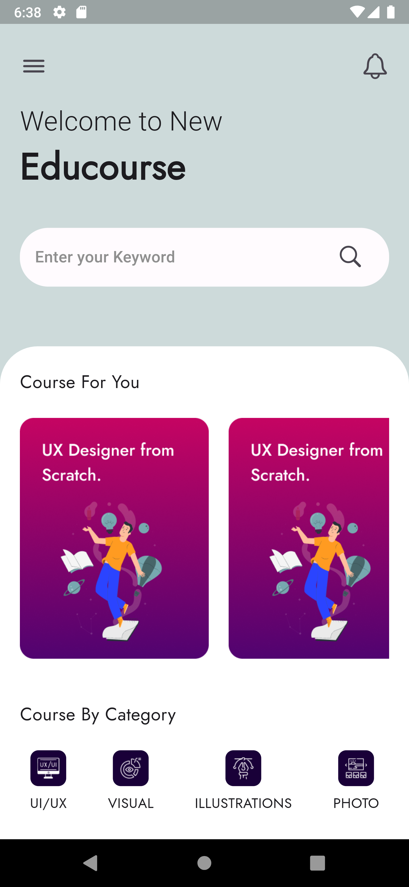
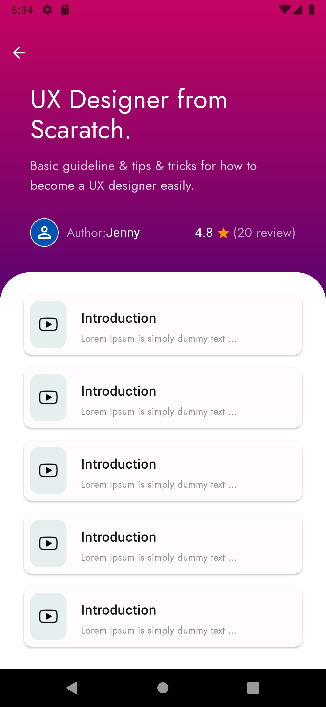

# Educourse Flutter Project

Welcome to Educourse, a platform designed to help you practice your UI skills in Flutter!

## Screenshots

### Home Screen

### Course Details Screen

## About Educourse
Educourse is a simple yet powerful platform where you can explore various courses and improve your skills. With a user-friendly interface and engaging content, Educourse makes learning fun and interactive.

## Features
- **Home Screen:** Browse through featured courses and discover new topics.
- **Course Details:** Get detailed information about each course, including description, instructor details, and curriculum.
- **User Profile:** Coming soon! Stay tuned for updates on personalized learning experiences.

## Getting Started
To run this project on your local machine, follow these steps:
1. Clone the repository.
2. Navigate to the project directory.
3. Run `flutter pub get` to install dependencies.
4. Connect your device or emulator.
5. Run `flutter run` to start the app.